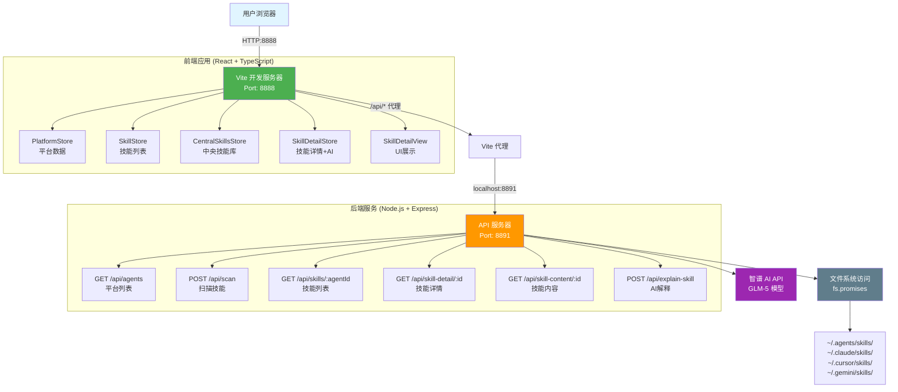
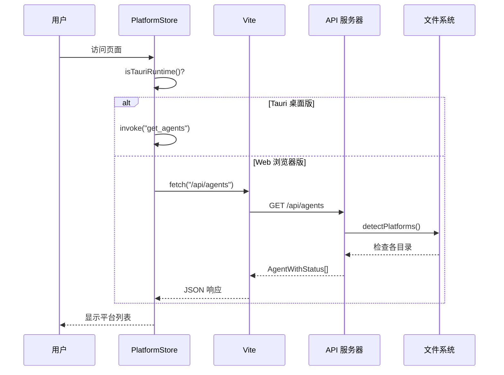
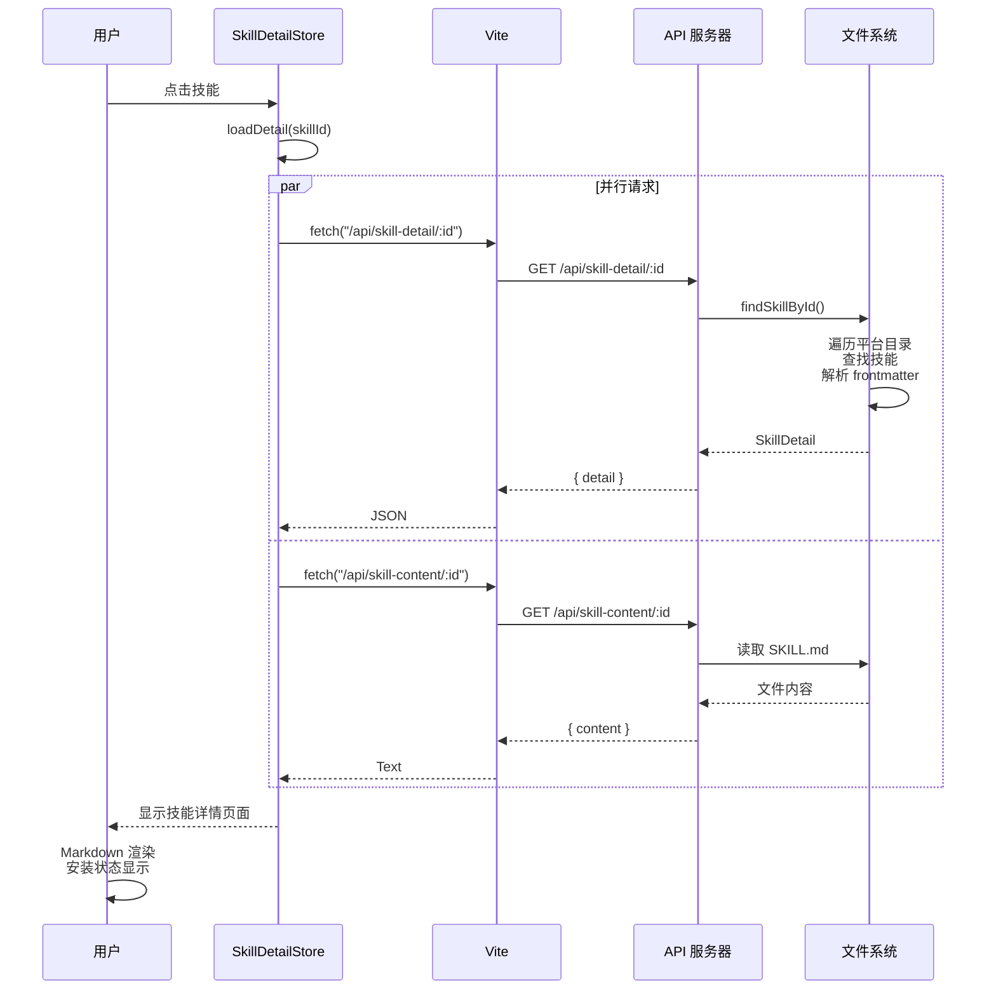
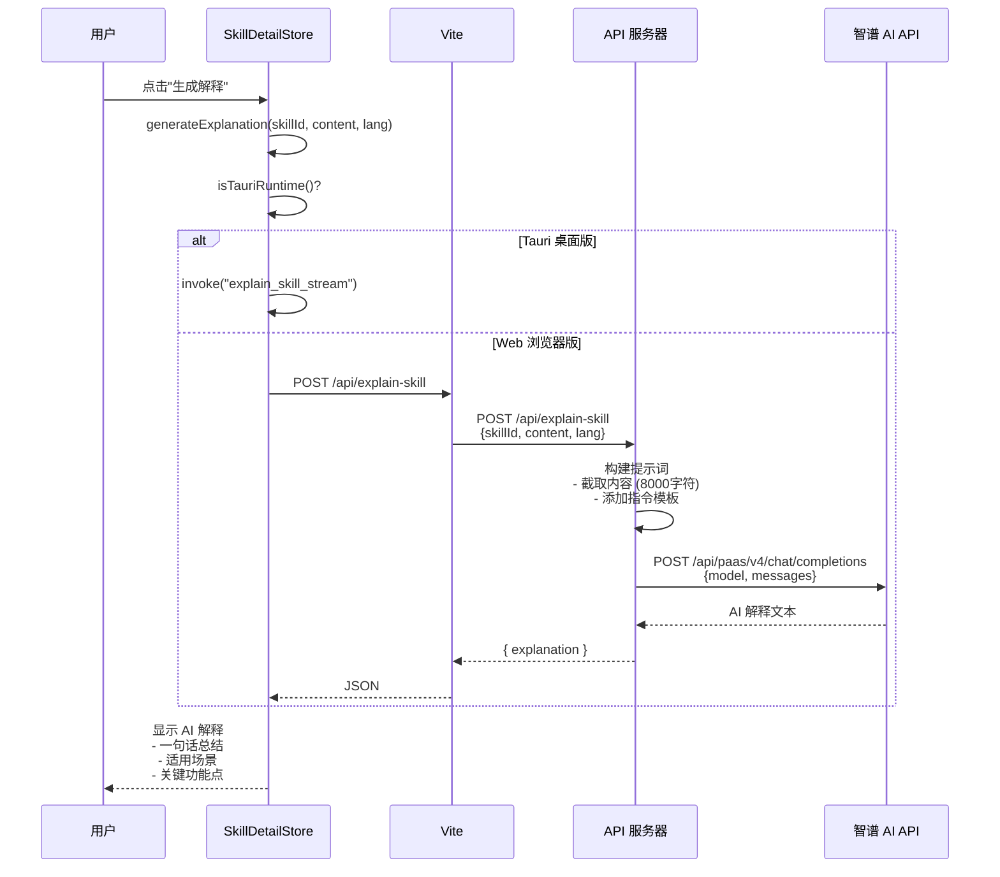
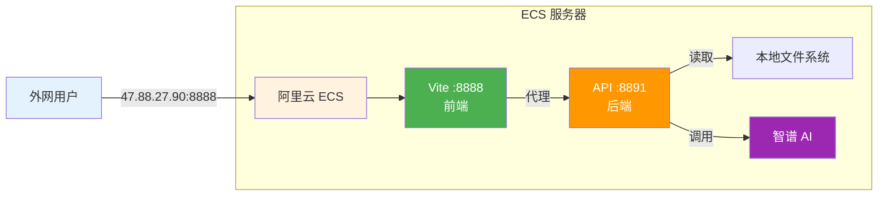
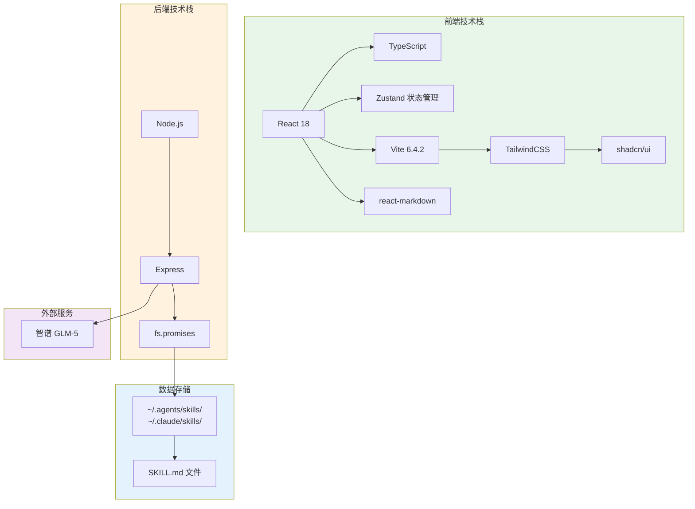
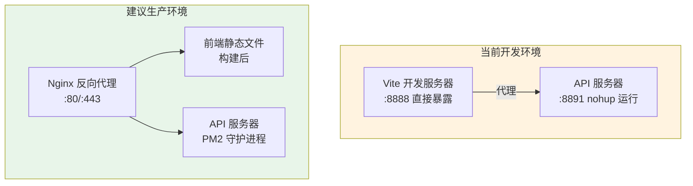
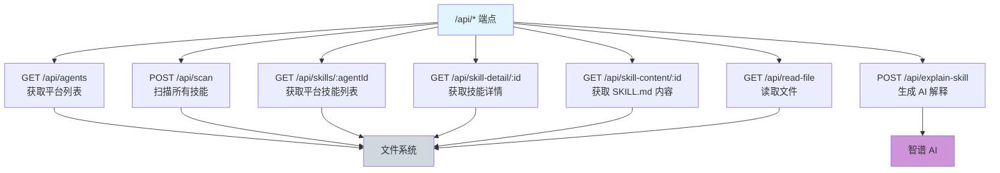

# Skills-Manage 系统架构图 (Mermaid 版本)

## 1. 整体架构图

## 2. 数据流向图 - 平台列表加载

## 3. 数据流向图 - 技能详情加载

## 4. 数据流向图 - AI 解释生成

## 5. 网络拓扑图

## 6. 技术栈组件图

## 7. 部署架构对比

## 8. API 端点总览

---

**使用说明：**

1. 在 GitHub 上，Mermaid 图表会自动渲染
2. 在支持 Mermaid 的 Markdown 编辑器中也能正常显示
3. 可以使用 Mermaid Live Editor (https://mermaid.live) 编辑和导出图片
4. 推荐使用此版本进行文档分享和演示

**相关文件：**
- `/tmp/skills-manage/ARCHITECTURE.md` - 文本版本
- `/tmp/skills-manage/docs/ARCHITECTURE_MERMAID.md` - Mermaid 图表版本
